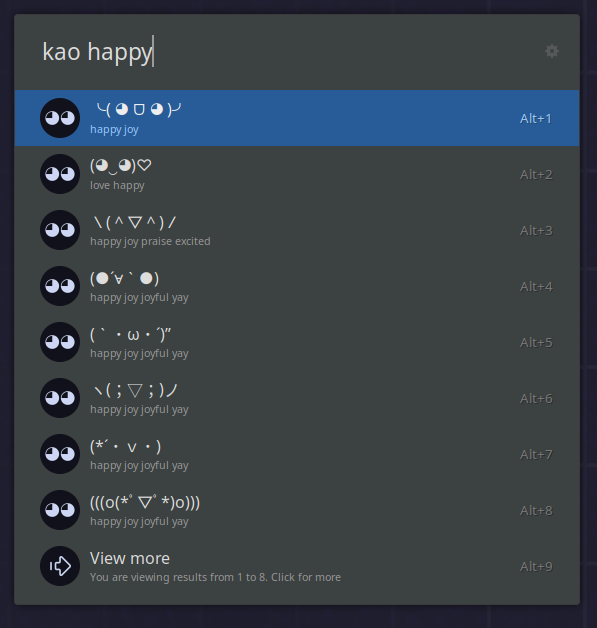
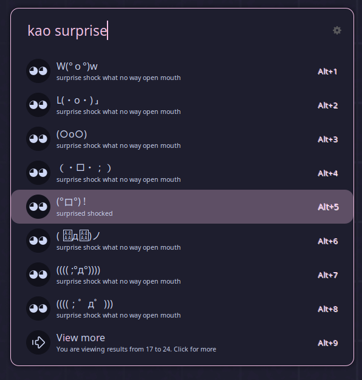
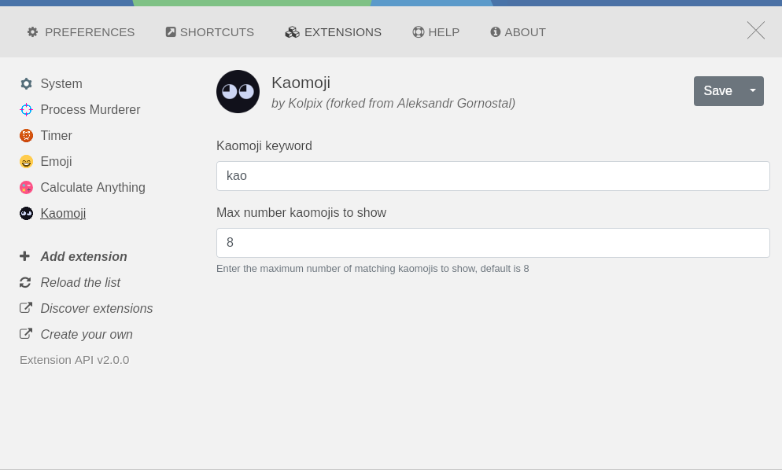

# Kaomoji Extension ╰( ◕ ᗜ ◕ )╯

<table>
  <tr>
    <td></td>
    <td></td>
  </tr>
</table>

## Update kaomoji data

To update Kaomoji data you need to replace the kaomojis.json file with an updated JSON that has the same structure.
Run the sqlthingy.py file after doing that and you should have a brand-new kaomojis.sqlite file!!

## Features

- Searching for Kaomojis and copying them ＼(＾▽＾)／

### Settings

  

## Credits (◕‿◕)♡

- [ulauncher-emoji](https://github.com/Ulauncher/ulauncher-emoji) by [Aleksandr Gornostal](https://github.com/gornostal) for the base code (like 99%) :heart:
- [FlowLauncher Kaomoji Plugin](https://github.com/mawiseman/Flow.Launcher.Plugin.Kaomoji/blob/main/Flow.Launcher.Plugin.Kaomoji/Assets/kaomoji.json) by [mawiseman](https://github.com/mawiseman) for kaomoji data :heart: